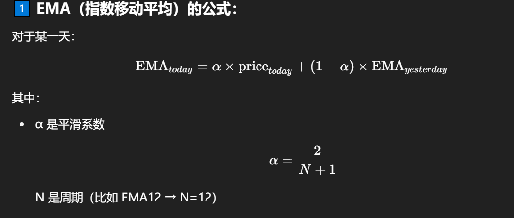
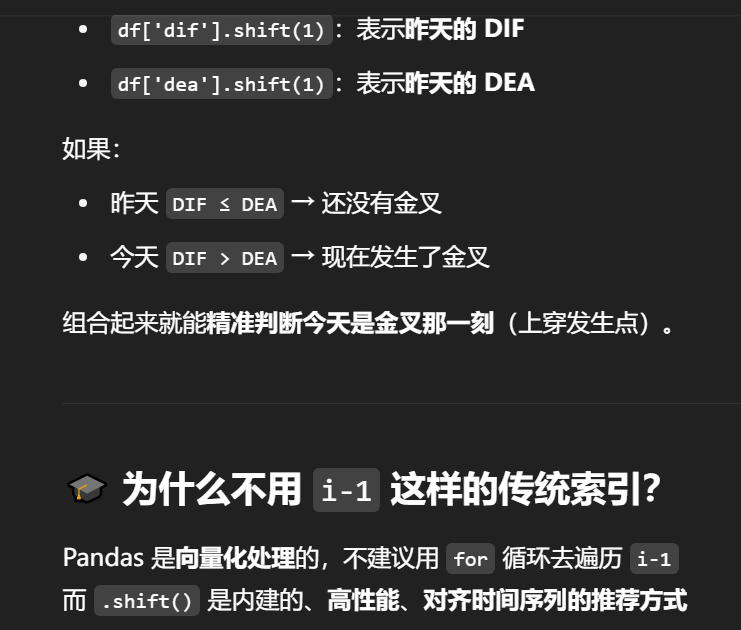

# MACD 金叉

## 概念

MACD 中的 快线 DIF 向上穿过 慢线 DEA 的时刻，
被认为是趋势转强，股价可能上涨的信号，通常用于判断买入时机。

## 指标

| 名称  | 计算方式            | 含义                 |
| ----- | ------------------- | -------------------- |
| EMA12 | 12 日指数移动平均   | 代表短期趋势         |
| EMA26 | 26 日指数移动平均   | 代表中期趋势         |
| DIF   | EMA12 - EMA26       | 快线，代表趋势强度   |
| DEA   | DIF 的 9 日移动平均 | 慢线，用于平滑 DIF   |
| MACD  | 2 × (DIF - DEA)     | 柱状图，衡量动量变化 |

## 金叉

当 DIF 从下方向上穿越 DEA 时

金叉出现 = 买入信号

## 死叉

DIF 从上往下穿越 DEA ➝ 死叉 ➝ 卖出信号

## 计算

## 步骤

1. 先算 EMA12 和 EMA26
2. 用它俩做差 → DIF
3. DIF 再平滑 → DEA
4. DIF - DEA × 2 → MACD 柱状图

# 解释

